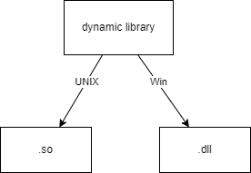

# Использование `Q_DECL_IMPORT`

***Библиотека*** — это набор готовых функций, классов и объектов для решения программных задач.


***Статическая библиотека*** - объектный моуль, код из которого выборочно или полностью вставляется в программу на этапе компоновки. При изменении чего-нибудь в библиотеке **требуется перекомпилировать** проект.

>*<u>Объектный модуль</u>* -  файл компиляции. <br>*Транслятор* переводит исходный код в машинный и записывает в объектный файл.<br><br><u>Модуль содержит:</u> <ul><li>*машинный код;</li> <li>список своих процедур и данных;</li><li>данные с неопределенными адресами ссылок на данные и процедуры в других объектных модулях.*</li></ul>Соединяется с другими объектными файлами при помощи *компоновщика* (вычисляет и заполняет адреса перекрестных ссылок между модулями) в один исполняемый файл.

Пример: `Boost`.

Расширение:


Плюсы: 
- Все функции в одном испольняемом файле.

Минусы:
- Проект разрастается и испольняемый файл занимает больше места.

***Динамическая библиотека*** - файлы подпрограмм на машинном коде, которые загружаются в приложение во время выполнения. Когда вы компилируете программу, использующую динамическую библиотеку, библиотека не становится частью вашего исполняемого файла – она ​​остается отдельной единицей.

Расширение:



Плюсы: 
- экономия памяти за счёт использования одной библиотеки несколькими процессами;
- возможность исправления ошибок (достаточно заменить файл библиотеки и перезапустить работающие программы) без изменения кода основной программы.

Недостатки:

- возможность нарушения API — при внесении изменений в библиотеку существующие программы могут перестать работать (утратят совместимость по интерфейсу);
- конфликт версий динамических библиотек, — разные программы могут нуждаться в разных версиях библиотеки;
- доступность одинаковых функций по одинаковым адресам в разных процессах — упрощает эксплуатацию уязвимостей (для решения проблемы изобретён `pic` [статья на эту тему](https://habr.com/ru/companies/badoo/articles/323904/)).

**Разделяемвая библиотека** - подтип *динамической библиотеки*, которая содержит функции используемые несколькими программами. Могут загружаться в адресное пространство ОС для экономии памяти: одна копия библиотеки будет использоваться несколькими процессами.

```cpp
#if defined(DLL_LIBRARY)
#define DLL_EXPORT Q_DECL_EXPORT
#else
#define DLL_EXPORT Q_DECL_IMPORT
#endif
```
Где `Q_DECL_EXPORT` и `Q_DECL_IMPORT` на препроцессинге подставляются как:
```cpp
#  define Q_DECL_EXPORT __declspec(dllexport)
#  define Q_DECL_IMPORT __declspec(dllimport)
```

Из мануала по Qt:
<p>Depending on your target platform, Qt provides special macros that contain the necessary definitions:

- `Q_DECL_EXPORT` must be added to the declarations of symbols used when `compiling` a shared library;
- `Q_DECL_IMPORT` must be added to the declarations of symbols used when compiling a client that `uses the shared` library.
</p>

&emsp;Макрос `Q_DECL_EXPORT` в QT5 используется для объявления символов из динамически подключаемой библиотеки (DLL) при компиляции динамисеской библиотеки.

&emsp;Макрос `Q_DECL_IMPORT` в QT5 используется для объявления экспорта символов из динамически подключаемой библиотеки (DLL), когда они используются в других модулях приложения. 

