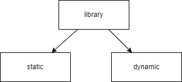
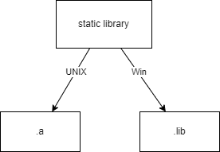

# Использование `Q_DECL_IMPORT`

***Библиотека*** — это набор готовых функций, классов и объектов для решения программных задач.

***Статическая библиотека*** - объектный моуль, код из которого выборочно или полностью вставляется в программу на этапе компоновки. При изменении чего-нибудь в библиотеке **требуется перекомпилировать** проект.

>*<u>Объектный модуль</u>* -  файл компиляции.  *Транслятор* переводит исходный код в машинный и записывает в объектный файл.  <u>Модуль содержит:</u> <ul><li>*машинный код;</li> <li>список своих процедур и данных;</li><li>данные с неопределенными адресами ссылок на данные и процедуры в других объектных модулях.*</li></ul>Соединяется с другими объектными файлами при помощи *компоновщика* (вычисляет и заполняет адреса перекрестных ссылок между модулями) в один исполняемый файл.

Пример: `Boost`.

Расширение:

Плюсы: 
- Все функции в одном испольняемом файле.

Минусы:

***Динамическая библиотека*** - 

**Разделяемвая библиотека** - 
