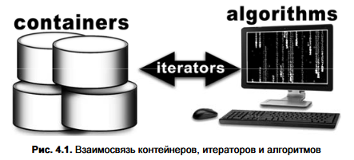

# Контейнеры Qt

Вся библиотека контейнеров в Qt имунуется `Tulip`. (Очень похожа на `STL`) Библиотека оптимизирована по памяти и производительности.

В основе Tulip лежат 3 понятия: контейнеры, итераторы, алгоритмы.

